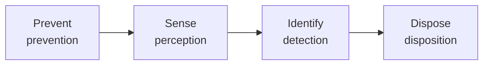

# Defender Guide

This page is for defenders — security / risk-control / anti-fraud teams. It explains how to use BREAK to go from "what risks might my business have" all the way to "what defenses should I deploy, in what order, and how do I weigh ROI".

## Core Flow: Scene → Risk → Avoidance → Defense-in-Depth → Validation

The defender's typical BREAK workflow is reverse inference: first locate the risk scenes relevant to your business, scope the related risks, then follow Risk → Avoidance to find measures, arrange defense-in-depth across the prevention–disposition phases, and finally validate with real Cases.

## Step 1: Locate Relevant Risks via Business Domains

Don't start by reading all 400 risks one by one. First identify your business category — finance, e-commerce, transportation, Web3, IoT, metaverse, etc. BREAK organizes business domains and risk scenarios in three layers:

- **BusinessDomain**: an industry / business-domain container, e.g. "Finance", "E-commerce"
- **RiskDimension**: an upper grouping within a scene, e.g. "Transaction dimension", "Identity dimension", "Adversarial dimension"
- **RiskScene**: a risk problem domain under a dimension, e.g. "Payment & financial fraud", "Interface & automation attacks"

The home page expands BusinessDomain → RiskDimension → RiskScene layer by layer; each RiskScene covers a set of Risks. Once you locate your business's RiskScene, its Risk list is your to-do list.

> Note: A RiskScene belongs exclusively to one dimension (it is never reused across dimensions), but the same Risk can appear in multiple RiskScenes (cross-scene classification — this is normal). Seeing a Risk in multiple scenes means it needs attention across several business touchpoints.

## Step 2: Follow Risk.avoidances to Find Measures

On the risk detail page (`/knowledges/risk/list#R0001`), every risk has an `avoidances` array — "the concrete measures that can mitigate this risk". Open any Avoidance to read its `definition` (one-line), `description` (detailed mechanism), and `limitation` (how it's bypassed / false-positive scenarios).

**Pay special attention to `limitation`**: it documents the real-world attacker counter-techniques and failure modes. A measure's limitation is often more valuable than its description — it tells you "once you deploy this, how the adversary bypasses it and what you should add next".

## Step 3: Arrange Defense-in-Depth Across prevention–disposition

Avoidance's `category` field groups all measures into the four phases of "prevent → sense → identify → dispose", which is also the standard skeleton for defense-in-depth:

| Phase | category | What it does | Signal traits |
|-------|----------|--------------|---------------|
| Prevent | prevention | Raise the attack bar so the attack can't succeed | CAPTCHA, device fingerprint, risk rules |
| Sense | perception | Collect detection signals, spot anomalies | Telemetry, traffic, behavioral features |
| Identify | detection | Use rules / models to judge anomalies | Thresholds, baselines, model matching |
| Dispose | disposition | Act on identification results | Rate-limiting, banning, manual review |

When planning defenses, ensure each critical risk has coverage across all four phases — don't pile up only prevention (prevent) and neglect perception/detection (sense/identify), which are key to detecting novel attacks. The rule that perception/detection descriptions must substantively describe "what signal is collected" or "what logic judges anomalies" is itself a checklist for defenders: if a measure's description only says "detects anomalies" without naming a signal, it has no reference value for you.

## Step 4: Weigh ROI with complexity

Every Risk has a `complexity` (basic / intermediate / advanced), indicating the attack bar:

- **basic**: low bar, no special resources needed — prioritize defending, highest ROI
- **intermediate**: needs some skill or tooling — monitor closely
- **advanced**: needs expertise / custom tools / multi-party coordination — dedicated response

With a limited budget, first complete the prevention prevent measures for basic risks, then handle intermediate's perception/detection sense/identify, and reserve a dedicated budget for advanced risks. This is far more effective than "spreading effort evenly".

## Step 5: Validate Measures Against Related Cases

Every Risk is recommended to have at least one high-quality Case as factual support. In the risk detail page's "Related Cases" section (reverse-queried via an inverted index), see how attackers actually struck and how defenders actually broke it in real events.

A Case's `category` indicates the event nature:

- `criminal_verdict` — criminal judgment, the hardest fact, with court-admitted techniques
- `administrative_enforcement` — records violations established by regulators or enforcement agencies, the legal basis, and the resulting action
- `security_incident` — presents the attack process, scope of impact, and the response and remediation measures taken
- `vulnerability_advisory` — explains the root cause, affected scope, exploitation conditions, and remediation guidance
- `academic_research` — uses systematic analysis or experiments to reveal attack methods, risk mechanisms, and defense effectiveness
- `news_report` — records the event time, parties involved, course of events, and broader impact

Criminal-verdict Cases are most valuable to defenders: they record facts admitted by a court, which you can directly compare against your own defense posture — "the court admitted this technique; am I defended against it?"

## Advanced: Lateral Relations Help Find "Complementary Defenses"

Beyond the main Risk.avoidances relation, BREAK has lateral-relation fields (auto-maintained by the `sync:lateral-relations` script):

- **Avoidance.relatedAvoidances**: measures that jointly cover certain risks — can be combined into defense-in-depth
- **Avoidance.relatedAttackTools**: measures that jointly constrain certain tools — multiple lines of defense against the same tool

These lateral relations are auto-derived — no manual maintenance needed. When you select an Avoidance, looking at its relatedAvoidances quickly reveals "other measures that pair with it", saving you from paging through one by one.

## Checklist

When a defender runs a risk inventory for a new business:

1. [ ] Locate the business's Business Domain (BusinessDomain), expand to specific RiskScenes
2. [ ] Export the Risk list covered by the RiskScene, sort by complexity
3. [ ] For each basic risk, confirm prevention prevent measures are in place
4. [ ] For each intermediate/advanced risk, confirm perception/detection sense/identify coverage
5. [ ] Review the limitation of each selected Avoidance, anticipate attacker bypass paths
6. [ ] Validate actual attack techniques against related Cases (prioritize criminal_verdict)
7. [ ] Expand laterally: follow relatedAvoidances to fill defense-in-depth gaps
