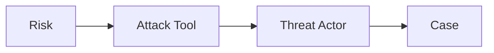

# Red Team Guide

This page is for red team / penetration testing / attack-defense exercise operators. It explains how to use BREAK to forward-infer a complete attack path from a single risk: pick a low-bar entry → find the implementation tool → simulate the attacker role → reproduce techniques with real cases.

> **Usage boundary**: This guide is for authorized security testing, attack-defense exercises, and security research. BREAK records abstractions of business risks and public cases; it does not provide exploit code. Actual testing must be conducted under explicit authorization.

## Core Flow: Risk → AttackTool → ThreatActor → Case

The red team's BREAK workflow is forward inference: starting from a Risk, follow `directCauseRisks` to find the AttackTool that creates it, follow `useAttackTools` to find the ThreatActor that uses these tools, and reproduce real techniques with Cases. This is exactly the direction visualized by the home page's "Attack Path" perspective.

## Step 1: Pick a Low-Bar Entry with complexity

The red team's target priority is the reverse of the defender's — defenders defend basic first, red team also attacks basic first. Filter by complexity=basic on the risk list page; these are low-bar, no-special-resource attack points, ideal as entry points.

But note basic ≠ low impact. A basic risk may have a low bar but broad impact (e.g. registration automation has an extremely low bar yet underpins the entire fraud chain). Entry selection must combine the Risk's `influence`: low bar + broad impact = best entry point.

## Step 2: Follow directCauseRisks to Find Attack Tools

On the risk detail page, Risk-to-AttackTool relations come in two types:

- **directCauseRisks**: risks the tool **directly causes** — this is "what tool hits this risk"
- **indirectSupportRisks**: risks the tool **indirectly supports** — auxiliary chain, for lateral expansion

Open any AttackTool to read its `description` (what the tool does, how it's used), `directCauseRisks` / `indirectSupportRisks` (which risks it can hit), and `avoidances` (which measures defenders use against it).

**Focus on the `avoidances` field** — it tells you which measures will detect / block this tool. Path design must anticipate defenses: if your chosen tool is immediately caught by some Avoidance on deployment, the path is dead — either swap tools or plan a bypass.

## Step 3: Simulate the Attacker Role via useAttackTools

ThreatActor links tools to people. Its relation fields distinguish "build" vs "use":

- **buildAttackTools**: tools the role **builds itself** — indicates development capability
- **useAttackTools**: tools the role **uses** — the role's common kit

ThreatActor describes "a class of roles" behavior patterns (wool-pullers, scalpers, SIM vendors, insiders, corporate spies, fraud rings, data brokers, ransom crews, etc.), not a specific org or person. Reading a ThreatActor's `description` helps you understand that role's motive, capability, and typical modus operandi, helping you "think like the attacker" when designing a playbook.

When simulating, ask yourself three questions:
1. Which ThreatActor am I playing now? Where are its capability boundaries?
2. Does its buildAttackTools include a self-developed tool I hadn't considered?
3. Its directCauseRisks / indirectSupportRisks define its operating range — is my target risk within it?

## Step 4: Visualize with the "Attack Path" Perspective

The home page graph's "Attack Path" perspective draws the chain above: pick a Risk as the start, expand the AttackTools referenced by its directCauseRisks, then expand the ThreatActors that useAttackTools-reference those tools. At a glance you see "which tools can hit this risk, and which roles use these tools".

The "Path Explorer" perspective is freer — start from any entity and walk the relationship edges freely, good for discovering non-obvious chains (e.g. a tool used by some ThreatActor happens to indirectly support a risk in your target business).

## Step 5: Reproduce Real Techniques with Cases

Cases are the factual layer. The risk / tool / actor detail pages all have a "Related Cases" section (inverted-index reverse query). Pick the Case closest to your target:

- `criminal_verdict`: see the court-admitted crime technique, profit scale, and division of labor — the most authentic attack playbook
- `security_incident`: see the publicly disclosed incident timeline
- `academic_research`: see the attack chain and defense assessment disclosed by research

When reproducing, extract three elements: **timeline** (incidentTime), **subject** (who did it), **facts** (how it was done). A Case's `summary` is an 80–150 word factual description; `references` gives the original source for deeper digging.

## Reverse Use: Find Bypass Points from a Defense Measure's limitation

This is the field the red team should read most. Every Avoidance's `limitation` documents "how it's bypassed / where it false-positives". List the target business's defense inventory, read each limitation, and these are your attack breakthroughs:

- "CAPTCHA can be solved by CAPTCHA-solving platforms" → the CAPTCHA AC01 prevent measure fails, bypassable
- "Device fingerprint can be spoofed by emulators" → device fingerprint fails
- "Behavior analysis false-positives heavily on new accounts" → use new accounts to bypass the behavior baseline

Stacking multiple limitations often assembles a complete bypass chain. This is far more efficient than blind testing.

## Checklist

When a red team plans an authorized test:

1. [ ] Confirm the authorization scope; clarify testable business and red lines
2. [ ] Locate target-business-related Risks in BREAK, pick basic entries by complexity
3. [ ] Follow directCauseRisks to find attack tools, assess usability
4. [ ] Check the chosen tool's avoidances, anticipate which defenses will block it
5. [ ] Pick the ThreatActor to role-play, confirm its capabilities cover the target risk
6. [ ] Visualize the full chain with "Attack Path" / "Path Explorer"
7. [ ] Reproduce real techniques against related Cases (prioritize criminal_verdict)
8. [ ] Read the limitation of the target defense inventory, locate bypass breakthroughs
9. [ ] Output the attack playbook: entry → tool → actor motive → expected blocks → bypass plan
