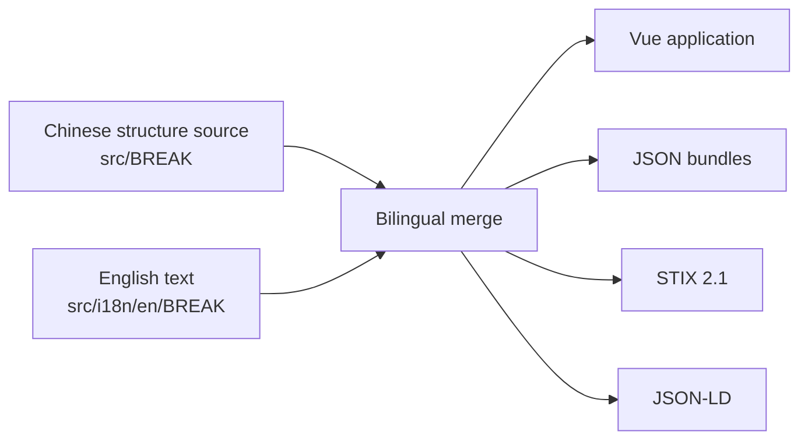

# Architecture & Data Pipeline

This page defines BREAK's authoritative data sources, runtime loading strategy, and generated-output boundaries. Before changing code or data, identify which module owns the field so derived relations and generated files are not edited manually.

## High-Level Flow

- `src/BREAK/` is the sole source of truth for structure, relations, and Chinese text.
- `src/i18n/en/BREAK/` stores translatable text only. Runtime data uses `mergeWithStructure` to combine it with the Chinese structure.
- `src/validation/breakSchema.ts` is authoritative for data shape; `DATA_SCHEMA.md` is its generated reference.
- `src/BREAK/entityRegistry.ts` is authoritative for the six knowledge-entity types. Routes, ID inference, search, and detail navigation derive from it.

## Data Loading

Risk, Avoidance, AttackTool, ThreatActor, and Term are part of the main BREAK object. Cases are much larger and load lazily through `src/composables/useCases.ts`; the home page does not load them. They load for the Case list, global search, or related-case reverse lookup.

BusinessDomain is authoritative for business classification. Risk files do not contain `relatedBusinessDomains`; classification lives only in `riskScenes[*].risks` under `src/BREAK/business-domains/*.json`.

## Relation Ownership

- Primary relations are maintained in Chinese source entities, including `Risk.avoidances`, `AttackTool.directCauseRisks`, and `ThreatActor.useAttackTools`.
- `Risk.relatedRisks` is a manually authored semantic relation and is not generated.
- Lateral relations on Avoidance, AttackTool, and ThreatActor are recalculated by `npm run sync:lateral-relations`; do not edit them manually.
- Case relations are maintained only on the Case side and exposed elsewhere through reverse indexes.

## Generated Outputs

The following paths are generated and are not manual editing targets:

| Output                                           | Command                                         |
| ------------------------------------------------ | ----------------------------------------------- |
| `src/i18n/en/.generated/`                        | `npm run generate:en-full`                      |
| `public/data/docs-manifest.json`, `public/docs/` | `npm run generate:docs`                         |
| `public/data/break-data*.json`                   | `npm run export:data`, `npm run export:data-en` |
| STIX / JSON-LD                                   | `npm run export:stix`, `npm run export:jsonld`  |
| `dist/break-data-package`                        | `npm run export:data-package`                   |

## Change Flow

1. Update the Chinese structure source and matching English text.
2. Run relation synchronization or entity-version bumping when applicable.
3. Run `npm run validate:data`.
4. Refresh generated docs or exports with the relevant command.
5. Run `npm run build` before submission.

See [Data Model & Field Reference](/docs/data-model) for entity rules and [Release & Maintenance](/docs/release-maintenance) for release operations.
