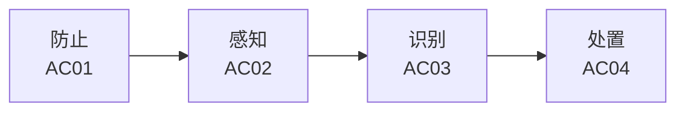

# 防御者使用指南

本文面向安全 / 风控 / 反欺诈的防守方，讲清楚如何用 BREAK 从「我的业务可能有什么风险」一路推到「我该上什么防御手段、按什么顺序上、投入产出怎么算」。

## 核心思路：场景 → 风险 → 规避 → 纵深 → 验证

防守方用 BREAK 的典型链路是反推：先定位自己业务所在的风险场景，圈出相关风险，再沿“风险 → 规避手段”找到对应措施，按 AC01–AC04 四环节排布纵深防御，最后用真实案例验证手段是否对路。

## 第一步：从业务域定位相关风险

不要一上来就逐条翻阅 400 条风险。先想清楚你的业务属于哪一类——金融、电商、交通出行、Web3、IoT、元宇宙等。BREAK 用三层结构组织业务域和风险场景：

- **业务域**：行业 / 业务域容器，如「金融」「电商」
- **风险维度**：场景内的上层分组，如「交易维度」「身份维度」「对抗维度」
- **风险场景**：维度下的风险问题域，如「支付资金金融欺诈」「接口与自动化攻击」

首页按“业务域 → 风险维度 → 风险场景”逐层展开，每个风险场景覆盖一组风险。定位到你业务的风险场景后，里面的风险列表就是你的「待办清单」。

> 同一条风险可能出现在多个风险场景中，这通常说明它会影响多个业务环节，需要结合各场景分别评估。

## 第二步：查看风险对应的规避手段

在风险详情页的「规避手段」区域，可以查看能缓解该风险的具体措施。点开任意规避手段，重点了解它的定义、工作机制和局限性。

**重点看局限性**：它描述该手段可能被绕过的方式、误报场景和失效条件，能帮助你判断「上了这个手段后，黑产会怎么绕，下一步该补什么」。

## 第三步：按 AC01–AC04 四环节排布纵深

BREAK 把规避手段归到业务安全防御的「防止 → 感知 → 识别 → 处置」四环节，这也是纵深防御的标准骨架：

| 环节 | 干什么 | 信号特征 |
|------|--------|----------|
| 防止（AC01） | 提高攻击门槛，让攻击做不成 | 验证码、设备指纹、风控规则 |
| 感知（AC02） | 采集检测信号，发现异常 | 埋点、流量、行为特征采集 |
| 识别（AC03） | 用规则 / 模型判定异常 | 阈值、基线、模型匹配 |
| 处置（AC04） | 对识别结果做动作 | 限频、封禁、人工审核 |

规划防御时，确保每个关键风险在四个环节都有覆盖，别只堆 AC01（防止）而漏掉 AC02/AC03（感知与识别）——后者是发现新型攻击的关键。

## 第四步：用攻击复杂度评估投入产出

风险详情中的攻击复杂度分为初级、中级和高级，用于表示攻击门槛：

- **初级**：攻击门槛低，无需特殊资源即可实施——优先防，性价比最高
- **中级**：需要一定技术或工具——重点监控
- **高级**：需专业知识 / 定制工具 / 多方协同——专项应对

预算有限时，优先把初级风险的 AC01 防止手段补齐，再处理中级风险的 AC02/AC03 感知识别，高级风险通常留专项预算。这比「平均用力」有效得多。

## 第五步：用相关案例验证手段是否对路

在风险详情页的「相关案例」区域，可以查看真实事件里攻击者如何实施攻击，以及事件暴露了哪些防御缺口。

案例类型标明事件性质：

- 刑事判决——包含法院认定的犯罪手法和事实
- 行政执法——包含监管或执法机关认定的违规事实、处置依据和处理结果
- 安全事件——呈现攻击过程、影响范围以及相关方的响应和处置措施
- 漏洞通报——说明漏洞成因、影响范围、利用条件和修复建议
- 学术研究——通过系统分析或实验揭示攻击方法、风险机制和防御效果
- 新闻报道——记录事件发生的时间、主体、经过和社会影响

刑事判决类案例对防守方价值最高：它记录了已被法庭认定的事实，可直接拿来跟你的防御现状对照——「这个手法判决书都认定了，我防住了没？」

## 进阶：横向关系帮你找「关联防御」

规避手段详情页还会展示两类横向关联：

- **相关规避手段**：共同覆盖某些风险的手段，可以组合成纵深防御
- **相关攻击工具**：这些手段共同限制的工具，可用于检查同一工具是否已有多道防线

选中一条规避手段后，可以通过这些关联快速发现配套措施，省去逐条翻找的过程。

## 检查清单

防守方落地一个新业务的风险盘点时，建议按此清单走：

1. [ ] 定位业务所属业务域，展开到具体风险场景
2. [ ] 导出风险场景覆盖的风险列表，按攻击复杂度排序
3. [ ] 对每条初级风险，确认 AC01 防止手段是否就位
4. [ ] 对每条中级 / 高级风险，确认 AC02/AC03 感知识别覆盖
5. [ ] 检查每条所选规避手段的局限性，预判黑产绕过路径
6. [ ] 用相关案例（优先刑事判决）核对实际攻击手法
7. [ ] 从相关规避手段中补齐纵深防御缺口
