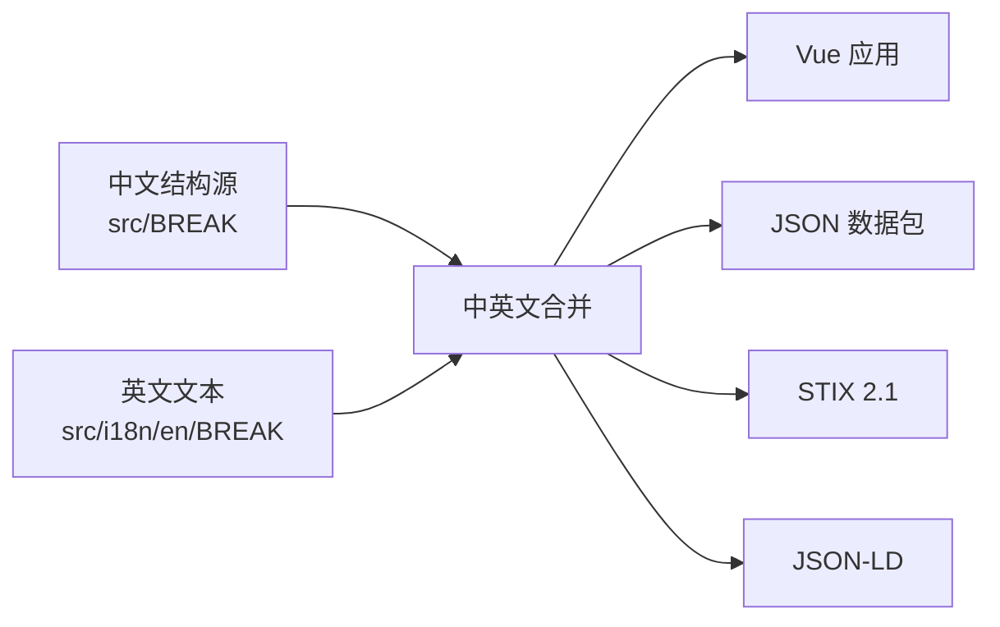

# 架构与数据流水线

本文说明 BREAK 的数据权威来源、运行时加载方式和构建产物边界。修改代码或数据前，应先确认目标字段由哪个模块维护，避免在生成文件或派生关系中重复写入。

## 总体结构

- `src/BREAK/` 是结构、关系和中文文本的唯一权威来源。
- `src/i18n/en/BREAK/` 只维护可翻译文本，运行时通过 `mergeWithStructure` 合并中文结构。
- `src/validation/breakSchema.ts` 是数据结构权威，`DATA_SCHEMA.md` 是由其生成的参考文档。
- `src/BREAK/entityRegistry.ts` 是六类知识实体的元信息权威，路由、ID 推断、搜索和详情入口从注册表派生。

## 数据加载

Risk、Avoidance、AttackTool、ThreatActor 和 Term 会进入 BREAK 主对象。Case 数量较大，由 `src/composables/useCases.ts` 懒加载；首页不会加载 Case，访问案例列表、全局搜索或相关案例反查时才加载。

BusinessDomain 是风险业务归类的权威来源。Risk 文件不维护 `relatedBusinessDomains`；归类关系只写在 `src/BREAK/business-domains/*.json` 的 `riskScenes[*].risks`。

## 关系所有权

- 主关系由中文源实体手工维护，例如 `Risk.avoidances`、`AttackTool.directCauseRisks` 和 `ThreatActor.useAttackTools`。
- `Risk.relatedRisks` 是带语义说明的人工关系，不由同步脚本生成。
- Avoidance、AttackTool、ThreatActor 的横向关系由 `npm run sync:lateral-relations` 自动重算，不要手工修改。
- Case 与其他实体的关系只在 Case 侧维护，详情页通过倒排索引反查。

## 生成产物

以下目录或文件由脚本生成，不应作为人工编辑入口：

| 产物                                             | 生成命令                                        |
| ------------------------------------------------ | ----------------------------------------------- |
| `src/i18n/en/.generated/`                        | `npm run generate:en-full`                      |
| `public/data/docs-manifest.json`、`public/docs/` | `npm run generate:docs`                         |
| `public/data/break-data*.json`                   | `npm run export:data`、`npm run export:data-en` |
| STIX / JSON-LD                                   | `npm run export:stix`、`npm run export:jsonld`  |
| `dist/break-data-package`                        | `npm run export:data-package`                   |

## 修改路径

1. 修改中文结构源及对应英文文本。
2. 运行关系同步或实体版本递增脚本（适用时）。
3. 运行 `npm run validate:data`。
4. 运行 `npm run generate:docs` 或相关导出命令刷新产物。
5. 提交前运行 `npm run build`。

实体字段规则见 [数据模型与字段说明](/docs/data-model)，发布流程见 [发布与维护](/docs/release-maintenance)。
